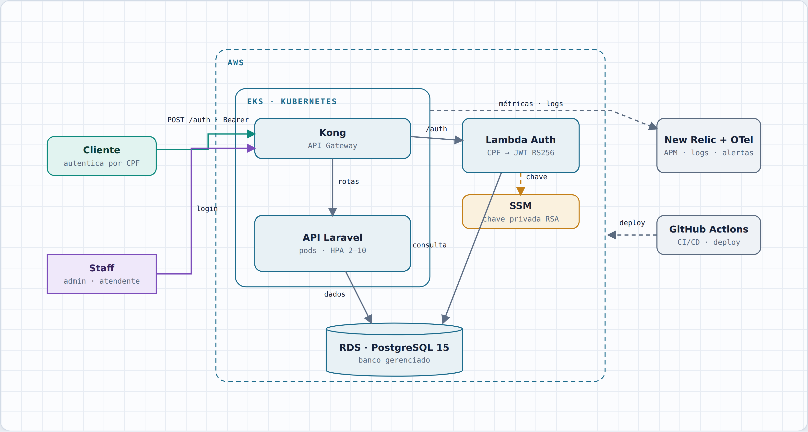
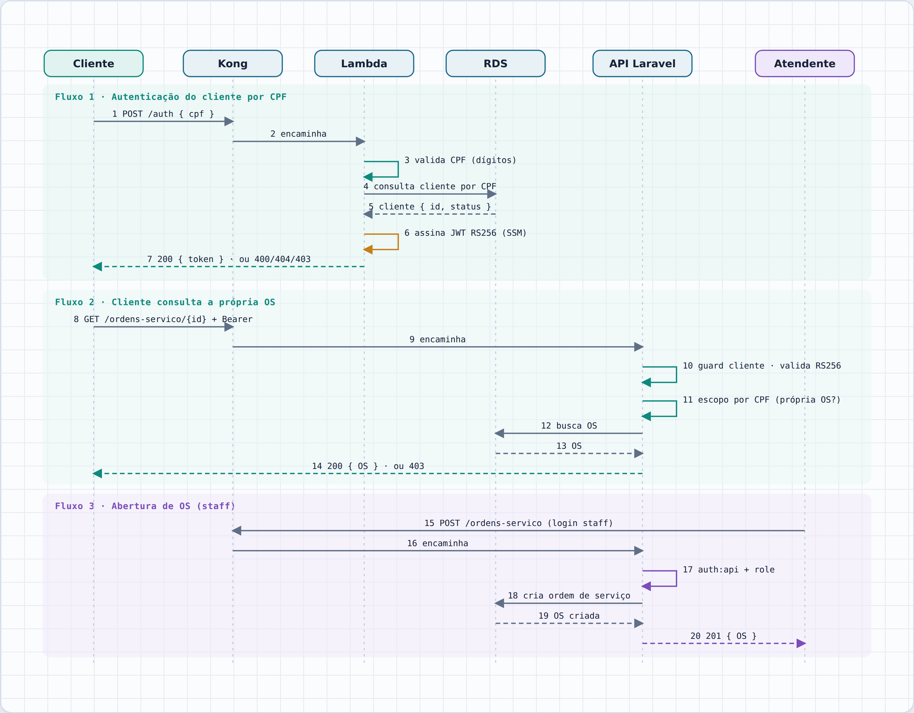
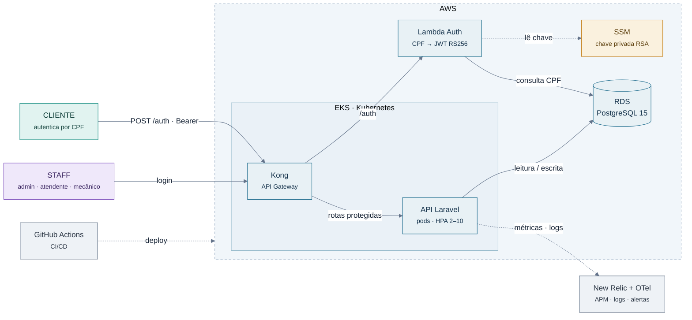
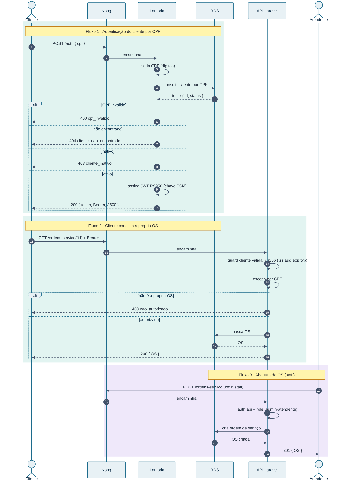

# Diagramas de Arquitetura — Fase 3

**Oficina Mecânica · Grupo 183 · FIAP SOAT Pós-Tech**

Documentação arquitetural da Fase 3: diagrama de **componentes** (visão de nuvem) e de **sequência** (autenticação por CPF + abertura de ordem de serviço). Os desenhos refletem as decisões registradas nos [RFCs](rfcs-fase3.md) e [ADRs](adrs-fase3.md) e no [contrato de autenticação](contrato-autenticacao.md).

> Dois **domínios de identidade** — **cliente** (por CPF, token RS256) e **staff** (login + role) — que nunca se cruzam. A cor **teal** marca o domínio cliente e a **violeta** o domínio staff.

---

## 1. Diagrama de Componentes

Visão de nuvem (AWS): API Gateway (Kong no EKS), Lambda de autenticação, aplicação em Kubernetes, banco gerenciado e observabilidade.

O **Kong** roda dentro do EKS e é a única porta de entrada. A **Lambda** assina o JWT com a chave privada do **SSM**; a API valida com a chave pública. Linhas tracejadas representam observabilidade e deploy.

---

## 2. Diagrama de Sequência

Cobre os três fluxos: autenticação do cliente por CPF, o cliente consultando a própria OS (guard cliente + escopo por CPF) e a abertura de OS pelo staff.

As bandas **teal** são o domínio cliente (token RS256, escopo por CPF); a banda **violeta** é o domínio staff (login + role). Um token de cliente nunca alcança uma operação de staff.

---

## Decisões que sustentam os diagramas

| ADR | Decisão |
|---|---|
| **ADR-0005** | **Cliente × Staff** — dois domínios de identidade independentes; token de cliente só acessa rotas de cliente, com escopo por CPF. |
| **ADR-0004** | **JWT RS256** — a Lambda assina com a chave privada (SSM); a API valida com a pública. |
| **ADR-0003** | **Kong no EKS** — API Gateway open-source rodando no cluster. |
| **ADR-0002** | **HPA 2–10** — escalabilidade automática (CPU 70% / memória 80%). |

---

<strong>Fonte editável (Mermaid)</strong> — para regenerar ou editar os diagramas

### Componentes

### Sequência

---

*Grupo 183 · FIAP SOAT Pós-Tech · Fase 3 · Diagramas · rev.2*
