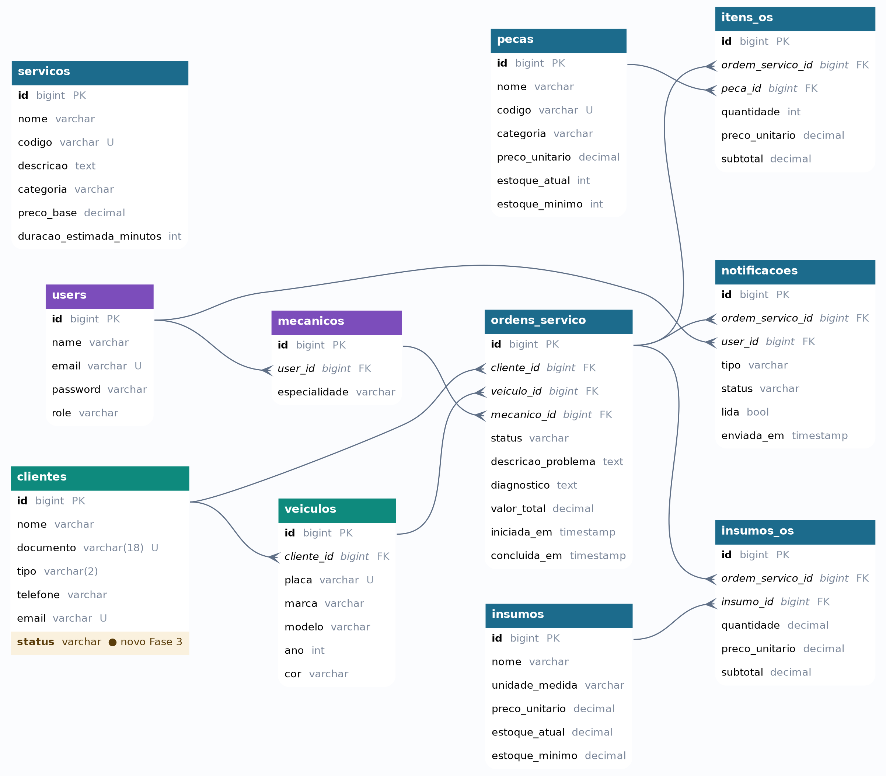

# Banco de Dados — Justificativa e Modelo Relacional (Fase 3)

**Oficina Mecânica · Grupo 183 · FIAP SOAT Pós-Tech**

Justificativa formal da escolha do banco de dados e da modelagem relacional, com o diagrama ER revisado e os ajustes introduzidos na Fase 3. Complementa o [contrato de autenticação](contrato-autenticacao.md) e os [ADRs](adrs-fase3.md).

---

## 1. Por que PostgreSQL 15 gerenciado (AWS RDS)

**Escolha do SGBD — PostgreSQL 15.** Avaliado contra MySQL 8 na Fase 2 e mantido na Fase 3 por:

- **Robustez em consultas complexas** e melhor conformidade com o padrão SQL (CTEs, window functions), úteis nas métricas de OS e relatórios.
- **Tipos avançados** (JSONB, arrays, tipos numéricos exatos com `decimal`), que dão flexibilidade sem abrir mão de integridade — os valores monetários usam `decimal(10,2)` e as quantidades de insumo `decimal(10,3)`.
- **Integração nativa com o Eloquent ORM** (Laravel 11), sem drivers ou configurações adicionais.
- **Ecossistema maduro** de extensões e ferramentas de observabilidade.

**Por que um banco relacional (e não NoSQL).** O domínio é fortemente **transacional e relacional**: uma ordem de serviço referencia cliente, veículo e mecânico, e agrega itens de peças e insumos que precisam ser consistentes (o `valor_total` deriva dos subtotais). Isso exige **integridade referencial** (chaves estrangeiras) e **transações ACID** — garantias que o modelo relacional entrega de forma natural.

**Por que gerenciado (RDS).** O RDS PostgreSQL entrega **backups automáticos, alta disponibilidade (Multi-AZ), patching e monitoramento** sem operação manual, alinhado ao objetivo de "operação corporativa" da Fase 3. O provisionamento é feito por Terraform, isolado no repositório `oficina-infra-database` (ADR-0001), em subnets privadas com acesso restrito à VPC.

---

## 2. Modelo Relacional (ER)

11 tabelas de negócio. Os cabeçalhos são coloridos por **domínio**: **staff** (violeta — `users`, `mecanicos`), **cliente** (teal — `clientes`, `veiculos`) e **negócio** (azul — ordens, itens, catálogos).



### Principais relacionamentos

| Relacionamento | Cardinalidade | Regra |
|---|---|---|
| `clientes` → `veiculos` | 1 : N | um cliente possui vários veículos (`ON DELETE CASCADE`) |
| `clientes` → `ordens_servico` | 1 : N | histórico de OS do cliente (`ON DELETE RESTRICT` — não apaga cliente com OS) |
| `veiculos` → `ordens_servico` | 1 : N | OS sempre referencia um veículo (`RESTRICT`) |
| `mecanicos` → `ordens_servico` | 1 : N | mecânico responsável, **opcional** (`ON DELETE SET NULL`) |
| `ordens_servico` → `itens_os` | 1 : N | peças aplicadas na OS (`CASCADE`) |
| `ordens_servico` → `insumos_os` | 1 : N | insumos consumidos na OS (`CASCADE`) |
| `pecas` → `itens_os` / `insumos` → `insumos_os` | 1 : N | catálogo referenciado nos itens (`RESTRICT`) |
| `ordens_servico` → `notificacoes` | 1 : N | eventos de notificação da OS (`CASCADE`) |
| `users` → `mecanicos` / `users` → `notificacoes` | 1 : N | identidade de staff |

As tabelas `itens_os` e `insumos_os` são **tabelas associativas** que resolvem o N:N entre OS e o catálogo (peças/insumos), guardando quantidade, preço unitário e subtotal no momento da OS. `servicos` é um **catálogo independente** (sem FK), consultado na composição do orçamento.

---

## 3. Ajustes no modelo para a Fase 3

A autenticação por CPF (contrato, seções 3–4) exige dois ajustes na tabela `clientes`:

### 3.1 Nova coluna `clientes.status` (ativo / inativo) — **obrigatória**

A Lambda de autenticação precisa responder **`403 cliente_inativo`** quando o cliente existe mas está inativo. Hoje a tabela `clientes` **não tem** essa coluna. Ajuste:

```php
// migration: add_status_to_clientes_table
Schema::table('clientes', function (Blueprint $table) {
    $table->string('status', 10)->default('ativo')->after('email'); // 'ativo' | 'inativo'
});
```

O claim `status` do JWT (contrato §4) passa a refletir esse valor.

### 3.2 Autenticação consulta `documento`, não `cpf`

Na Fase 2, a coluna `cpf` foi substituída por **`documento` (18) + `tipo` (2)** com índice único em `(documento, tipo)` — para suportar CPF e CNPJ. Portanto:

- A consulta da Lambda por CPF deve buscar em **`documento` com `tipo = 'pf'`** (não em uma coluna `cpf`).
- O mock em `oficina-lambda-auth/src/repo.js` usa o campo `cpf`; ao trocar pelo RDS, a query real deve usar `documento`/`tipo`. O índice único já garante busca performática.

Nenhuma outra tabela precisa mudar para a Fase 3 — o restante do modelo da Fase 2 é reaproveitado integralmente.

---

## 4. Convenções

- **Chaves primárias** `id` (`bigint`, auto-incremento) em todas as entidades de negócio.
- **Valores monetários** em `decimal(10,2)`; **quantidades de insumo** em `decimal(10,3)` (fracionárias).
- **`ON DELETE`** escolhido por regra de negócio: `CASCADE` para dependentes fracos (itens, notificações), `RESTRICT` onde apagar destruiria histórico (cliente/veículo com OS), `SET NULL` para o vínculo opcional do mecânico.

---

*Grupo 183 · FIAP SOAT Pós-Tech · Fase 3 · Banco de Dados · rev.1*
